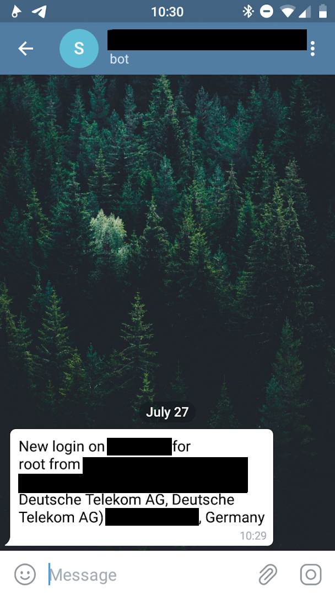

[](https://goreportcard.com/report/gitlab.com/soerenschneider/ssh-login-notification)

sends a notification (preferably) via telegram when a successful SSH login event occurred.

## configuration
Create a config file in either /etc/default/sshnotification.json or $HOME/.sshnotification/sshnotification.json:

```
{
    "telegram_token": "your-super-secret-bot-token",
    "telegram_id": 123456789
}
```

Add the following line as the last line in /etc/pam.d/sshd:

```
session optional pam_exec.so /path/to/sshloginnotification
```

## screenshot

